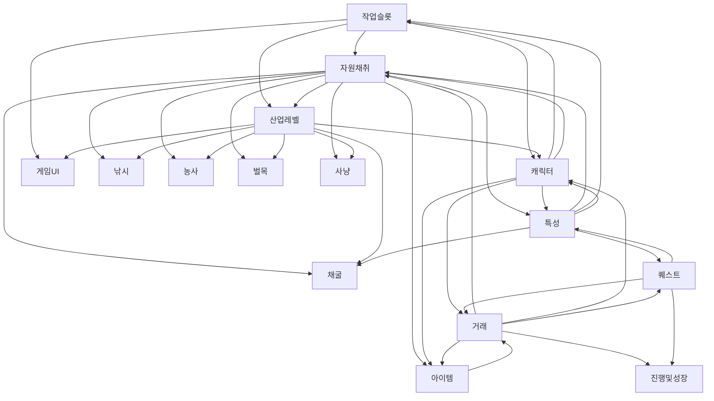

# 문서 관계도 — 기획 문서 의존 그래프

> 최종 업데이트: 2026-08-02
>
> **기획 문서를 고치기 전과 후에 보는 문서다.**
> 전에는 "무엇을 함께 읽어야 하는가", 후에는 **"무엇을 함께 고쳐야 하는가"** 를 알려 준다.
> 그래프의 단일 원본이며, 각 문서 헤더의 `바뀌면 갱신` 블록은 이 표에서 파생된 요약이다.

---

## 0. 왜 있는가

**하위 문서만 고치고 상위·형제 문서를 안 고치는 사고가 반복됐다.** (2026-08-02 전수 확인)

| 실제로 새어 나간 것 | 경위 |
| --- | --- |
| `Hunting` enum | `Enum.xlsx`에 `5`로 추가됐는데 `자원채취/README.md`는 "아직 없다 · 값 `7`로 추가 필요"로 남았다 |
| 아이템 30종 → 150종 | `산업레벨.md`가 120종을 추가했는데 `아이템/README.md`·`게임기획코어.md`는 30종 그대로다 |
| `ItemRarity` → `GlobalRarity` | 코드·아이템 문서만 따라가고 자원채취·게임UI·기획평가·낚시·채굴에 옛 이름이 남았다 |

셋 다 **역참조 경로를 따라가지 않아서** 생겼다. 이 문서는 그 경로를 명시하고,
[`check-doc-graph.ps1`](../check-doc-graph.ps1)이 어긋남을 기계로 잡는다.

---

## 1. 층위

문서는 **네 층**이고, 의존은 대체로 아래에서 위로 흐른다.

| 층 | 문서 | 성격 |
| --- | --- | --- |
| **허브** | [`게임기획코어`](게임기획코어.md) | 모든 문서와 **양방향**. 확정/미확정 현황이 여기 모인다 |
| **리뷰** | [`기획평가`](기획평가.md) | 다른 문서를 평가한다. 기획 자체가 아니다 |
| **시스템** | [`작업슬롯`](작업슬롯/README.md) · [`자원채취`](자원채취/README.md) · [`캐릭터`](캐릭터/README.md) · [`특성`](특성/README.md) · [`아이템`](아이템/README.md) · [`거래`](거래/README.md) · [`퀘스트`](퀘스트/README.md) · [`진행 및 성장`](진행%20및%20성장/README.md) · [`게임UI`](게임UI/README.md) | 시스템별 상세 기획안 |
| **콘텐츠** | [`산업레벨`](자원채취/산업레벨.md) · [`낚시`](자원채취/낚시/README.md) · [`농사`](자원채취/농사/README.md) · [`벌목`](자원채취/벌목/README.md) · [`채굴`](자원채취/채굴/README.md) · [`사냥`](자원채취/사냥/README.md) | 1차 산업 5종과 그 공통 축 |

> **`게임기획코어`는 그림에서 뺐다.** 16개 문서 **전부와 양방향**이라 선을 그으면 읽을 수 없다.
> **어느 문서를 고치든 `게임기획코어` 5장(확정/미확정 현황)은 항상 확인한다.**

### 굵은 의존 (허브 제외)

**화살표는 전파 방향이다 — `A ──> B` 는 "A가 바뀌면 B를 고쳐야 한다".**



**순환이 정상이다.** `캐릭터 ↔ 작업슬롯`, `아이템 ↔ 거래`처럼 서로를 참조하는 쌍이 여럿 있다.
전파할 때는 **이미 방문한 문서를 다시 열지 않는 것**으로 멈춘다 (3장).

---

## 2. 전체 그래프

### 2.1 이 문서가 바뀌면 갱신할 곳 (역참조)

**고친 뒤에 보는 표다.** 왼쪽을 고쳤으면 오른쪽을 **전부 열어 본다.**

| 고친 문서 | 함께 고쳐야 하는 문서 | 수 |
| --- | --- | --- |
| **게임기획코어** | **전부** (아래 16개) | 16 |
| **자원채취** | 거래 · 게임UI · 게임기획코어 · 기획평가 · 낚시 · 농사 · 벌목 · 사냥 · 산업레벨 · 아이템 · 작업슬롯 · 진행 및 성장 · 채굴 · 특성 | 14 |
| **산업레벨** | 게임UI · 게임기획코어 · 기획평가 · 낚시 · 농사 · 벌목 · 사냥 · 자원채취 · 작업슬롯 · 채굴 · 캐릭터 | 11 |
| **특성** | 게임기획코어 · 기획평가 · 산업레벨 · 아이템 · 자원채취 · 작업슬롯 · 진행 및 성장 · 채굴 · 캐릭터 · 퀘스트 | 10 |
| **거래** | 게임UI · 게임기획코어 · 기획평가 · 아이템 · 자원채취 · 작업슬롯 · 진행 및 성장 · 캐릭터 · 퀘스트 · 특성 | 10 |
| **캐릭터** | 거래 · 게임기획코어 · 산업레벨 · 아이템 · 자원채취 · 작업슬롯 · 진행 및 성장 · 특성 | 8 |
| **작업슬롯** | 게임UI · 게임기획코어 · 낚시 · 산업레벨 · 자원채취 · 캐릭터 · 특성 | 7 |
| **사냥** | 게임UI · 게임기획코어 · 기획평가 · 산업레벨 · 자원채취 · 진행 및 성장 | 6 |
| **퀘스트** | 거래 · 게임기획코어 · 자원채취 · 진행 및 성장 · 특성 | 5 |
| **낚시** | 게임기획코어 · 기획평가 · 산업레벨 · 자원채취 | 4 |
| **농사** | 게임기획코어 · 기획평가 · 산업레벨 · 자원채취 | 4 |
| **채굴** | 게임기획코어 · 기획평가 · 산업레벨 · 자원채취 | 4 |
| **벌목** | 게임기획코어 · 기획평가 · 자원채취 | 3 |
| **아이템** | 거래 · 게임기획코어 · 기획평가 | 3 |
| **게임UI** | 게임기획코어 · 산업레벨 · 퀘스트 | 3 |
| **기획평가** | 게임기획코어 · 사냥 · 자원채취 | 3 |
| **진행 및 성장** | 게임기획코어 · 기획평가 | 2 |

> ⚠️ **`자원채취`·`산업레벨`·`특성`·`거래`가 위험 지대다.** 한 줄을 고쳐도 10곳 이상이 흔들린다.
> 이 넷을 고칠 때는 [`check-doc-graph.ps1`](../check-doc-graph.ps1)을 **반드시** 돌린다.

### 2.2 이 문서를 쓸 때 참고할 문서 (정참조)

**고치기 전에 보는 표다.** 왼쪽을 쓰려면 오른쪽을 먼저 읽는다.

| 작성하는 문서 | 먼저 읽을 문서 |
| --- | --- |
| **게임기획코어** | 전부 (현황을 모으는 문서다) |
| **자원채취** | 거래 · 게임기획코어 · 기획평가 · 낚시 · 농사 · 벌목 · 사냥 · 산업레벨 · 작업슬롯 · 채굴 · 캐릭터 · 퀘스트 · 특성 |
| **기획평가** | 거래 · 게임기획코어 · 낚시 · 농사 · 벌목 · 사냥 · 산업레벨 · 아이템 · 자원채취 · 진행 및 성장 · 채굴 · 특성 |
| **산업레벨** | 게임UI · 게임기획코어 · 낚시 · 농사 · 사냥 · 자원채취 · 작업슬롯 · 채굴 · 캐릭터 · 특성 |
| **진행 및 성장** | 거래 · 게임기획코어 · 사냥 · 자원채취 · 캐릭터 · 퀘스트 · 특성 |
| **게임UI** | 거래 · 게임기획코어 · 사냥 · 산업레벨 · 자원채취 · 작업슬롯 |
| **작업슬롯** | 거래 · 게임기획코어 · 산업레벨 · 자원채취 · 캐릭터 · 특성 |
| **특성** | 거래 · 게임기획코어 · 자원채취 · 작업슬롯 · 캐릭터 · 퀘스트 |
| **거래** | 게임기획코어 · 아이템 · 자원채취 · 캐릭터 · 퀘스트 |
| **아이템** | 거래 · 게임기획코어 · 자원채취 · 캐릭터 · 특성 |
| **캐릭터** | 거래 · 게임기획코어 · 산업레벨 · 작업슬롯 · 특성 |
| **퀘스트** | 거래 · 게임UI · 게임기획코어 · 특성 |
| **낚시** | 게임기획코어 · 산업레벨 · 자원채취 · 작업슬롯 |
| **사냥** | 게임기획코어 · 기획평가 · 산업레벨 · 자원채취 |
| **채굴** | 게임기획코어 · 산업레벨 · 자원채취 · 특성 |
| **농사** · **벌목** | 게임기획코어 · 산업레벨 · 자원채취 |

---

## 3. 전파 규칙 — 재귀적으로 따라간다

**한 단계만 보고 멈추지 않는다.** 갱신한 문서가 또 다른 문서의 전파원이 되기 때문이다.

```
전파(고친 문서):
    큐 = [고친 문서]
    방문 = {}
    while 큐:
        문서 = 큐.pop()
        if 문서 in 방문: continue     ← 순환은 여기서 멈춘다
        방문.add(문서)

        for 대상 in 역참조[문서]:      ← 2.1 표
            대상을 연다
            if 이번 변경이 대상의 서술을 낡게 만들었나?
                대상을 고친다
                대상의 "최종 업데이트"를 오늘로 바꾼다
                큐.push(대상)          ← 고쳤으면 그 문서에서 또 퍼진다
            else:
                넘어간다               ← 열어 보고 안 고치는 것이 정상이다
```

| 규칙 | 내용 |
| --- | --- |
| **깊이 제한 없음** | 2단계·3단계까지 간다. 대부분 2단계에서 자연히 멎는다 |
| **순환은 방문 표시로 끊는다** | `캐릭터 ↔ 작업슬롯`처럼 서로 참조하는 쌍이 있다 |
| **고친 문서만 큐에 넣는다** | 열어 보고 그대로면 거기서 가지가 끝난다 |
| **날짜는 고친 문서만 바꾼다** | 안 고친 문서의 날짜를 올리면 역전 검사가 무력해진다 |
| **게임기획코어 5장은 항상** | 확정/미확정이 바뀌었으면 반드시 반영한다 |

### 3.1 무엇이 "낡게 만드는" 변경인가

전부를 다 고칠 필요는 없다. **아래에 해당할 때만** 대상 문서를 손댄다.

| 유형 | 예 | 전파 대상 |
| --- | --- | --- |
| **이름이 바뀜** | `ItemRarity` → `GlobalRarity` | 그 이름을 적은 **모든** 문서 |
| **수치·개수가 바뀜** | 아이템 30종 → 150종 | 그 수를 인용한 문서 |
| **확정 상태가 바뀜** | ❌ 미정 → ✅ 확정 | 게임기획코어 5장 + 그 항목을 "미정"으로 적은 문서 |
| **폐지** | 요일 로테이션 폐지 | 그 시스템을 전제로 쓴 문서 |
| **구조가 바뀜** | 판정 비용이 상수 → 테이블 | 그 구조를 서술한 문서 + **코드·엑셀** (4장) |
| 표현만 다듬음 | 문장 정리, 오타 | **전파하지 않는다** |

---

## 4. 문서 밖으로 나가는 그래프 — 엑셀·코드

**기획 문서끼리만 맞으면 절반이다.** 확정된 기획은 엑셀과 코드로도 흘러야 한다.
2026-08-02에 발견된 불일치의 절반이 이 경로에서 끊겨 있었다.

| 기획 문서 | 엑셀 (원본) | 생성 테이블 | 서버 코드 |
| --- | --- | --- | --- |
| [`아이템`](아이템/README.md) | `Item.xlsx` · `Gacha.xlsx` · `Enum.xlsx` | `ItemTable` · `GachaTable` · `ItemType` · `GlobalRarity` | `Inventory` · `GachaService` · `GachaPoolCatalog` |
| [`자원채취`](자원채취/README.md) · 산업 5종 | `Drop.xlsx` | `<산업>BasicTable` | `DropTableCatalog` · `WorkStation` |
| [`산업레벨`](자원채취/산업레벨.md) | `Industry.xlsx` | `IndustryLevelTable` | ⚠️ **미구현** (일감 T-017) |
| [`캐릭터`](캐릭터/README.md) | `Character.xlsx` | `CharacterTable` · `WorkSpeedTable` | `Character` · `WorkSpeed` |
| [`작업슬롯`](작업슬롯/README.md) | — | — | `WorkStationSlot` · `User.WorkStation` |
| [`거래`](거래/README.md) | — (`BasePrice` 미작성) | — | `CurrencyWallet` |
| [`특성`](특성/README.md) · [`퀘스트`](퀘스트/README.md) · [`진행 및 성장`](진행%20및%20성장/README.md) | — | — | — (미구현) |
| [`게임UI`](게임UI/README.md) | — | — | `Assets/Scripts_Client` |

**전파 순서는 한 방향이다.**

```
기획 문서 확정  →  GameDesign/Excel/*.xlsx  →  generate-tables.ps1  →  생성물  →  서버 코드
```

> ⚠️ **엑셀만 앞서 나가면 "미구현"이 아니라 "오동작"이 된다.**
> 2026-08-01에 드롭 시트가 레벨별로 갈라졌는데 `DropTableCatalog`가 `IndustryLevel`을
> 읽지 않아, **Lv1 슬롯에서 Lv5 아이템이 나오는 상태**가 됐다.
> 엑셀 구조를 바꿀 때는 그 시트를 읽는 서버 코드를 **같은 작업 단위로** 본다.

> **기획이 확정됐는데 코드가 못 따라가면 [`일감/`](../../일감/README.md)에 남긴다.**
> 문서에는 반드시 `❌ 미구현 (일감 T-0XX)`를 적는다 — 적어 두지 않으면
> 다음 사람이 "구현됐다"고 읽는다.

---

## 5. 검사 도구

```powershell
# 커밋 전 — 이번에 고친 문서에서 출발하는 전파만 본다 (git 기준). 평소엔 이것을 쓴다
powershell -File GameDesign/check-doc-graph.ps1 -Changed

# 전수 점검 — 저장소 전체의 미전파를 훑는다 (경고가 많이 뜬다)
powershell -File GameDesign/check-doc-graph.ps1

# 그래프 덤프 — 이 문서의 2장 표를 갱신할 때
powershell -File GameDesign/check-doc-graph.ps1 -Graph

# 각 문서 헤더의 "바뀌면 갱신" 블록을 실제 그래프에 맞춰 다시 쓴다
powershell -File GameDesign/check-doc-graph.ps1 -Fix
```

> **`-Changed`가 기본 사용법이다.** 커밋 전에 알고 싶은 것은
> **"방금 고친 문서가 전파됐는가"** 하나뿐이다.

### 5.1 확인 완료 — 전파하지 않기로 한 것 (2026-08-02)

전수 정리 후 남은 **경고 11건은 전부 확인했고, 고칠 것이 없어 남겨 둔 것**이다.
날짜 역전은 사실이지만 이번 변경이 이 문서들의 서술을 낡게 만들지 않았다.

| 대상 | 열어서 확인한 것 |
| --- | --- |
| **특성** | 아이템 종수·산업 레벨에 대한 서술이 없다. 2026-08-01 전면 재작성 때 재료 용도를 이미 걷어냈다 |
| **퀘스트** | 요일 로테이션 폐지가 이미 반영돼 있다. 아이템 종수를 인용하지 않는다 |
| **진행 및 성장** | 요일 폐지 반영 완료. 성장 곡선이 전부 미정이라 인용할 수치가 없다 |
| **거래** | `BasePrice`를 **아이템 5장 참조로만** 적는다. 종수를 직접 쓰지 않아 150종 변경의 영향이 없다 |

> **이 표가 경고를 소음이 아니라 기록으로 만든다.** 다음에 같은 경고를 보면
> 여기부터 확인하고, 그 사이 새 변경이 있었는지만 판단하면 된다.

| 검사 | 성격 | 의미 |
| --- | --- | --- |
| 깨진 링크 | **오류** | 폴더·파일 이름을 바꾸면서 참조를 안 고쳤다 |
| `바뀌면 갱신` 블록 누락 | **오류** | `-Fix`로 만든다 |
| 블록 ↔ 그래프 불일치 | **오류/경고** | 링크를 추가·삭제하고 블록을 안 고쳤다 |
| **갱신일 역전** | **경고** | **A가 B보다 최신인데 A→B 전파 대상이다 — 전파를 빠뜨렸을 수 있다** |

> **갱신일 역전은 오류가 아니라 경고다.** "A를 고쳤지만 B에는 영향이 없었다"가
> 정상적으로 존재하기 때문이다. 경고를 보고 **사람이 판단**한다.
> 다만 경고가 쌓여 배경 소음이 되면 검사가 죽는다 — 확인했으면 B의 날짜를 올리거나
> 왜 전파하지 않았는지 문서에 한 줄 남긴다.

---

## 6. 문서를 추가·삭제할 때

| 작업 | 할 일 |
| --- | --- |
| **새 기획 문서** | ① 헤더에 `> **바뀌면 갱신:** …` 한 줄 (`-Fix`로 생성) ② `게임기획코어` 3·4장에 행 추가 ③ 이 문서 1·2장에 행 추가 ④ [`game-design-reference`](../../.claude/skills/common/game-design-reference/SKILL.md) 문서 지도에 행 추가 |
| **문서 삭제** | 이 문서 2장 · `게임기획코어` 시스템 지도 · 그 문서를 참조하던 문서의 링크를 **전부** 지운다. `check-doc-graph.ps1`이 깨진 링크로 잡아 준다 |
| **폴더 이름 변경** | 링크가 조용히 깨진다. 변경 후 **반드시** 검사를 돌린다 |
| **그래프만 갱신** | `-Graph`로 덤프해 2장 표를 대체하고, `-Fix`로 각 문서 헤더를 맞춘다 |

> 문서 이름은 **항상 한글**이다. `Excel`·`DataLog`만 코드가 경로를 참조해 예외다.
> → [`CLAUDE.md`](../../CLAUDE.md) "이름 규칙"

---

*Window Simulator · 문서 관계도 · 2026-08-02*
